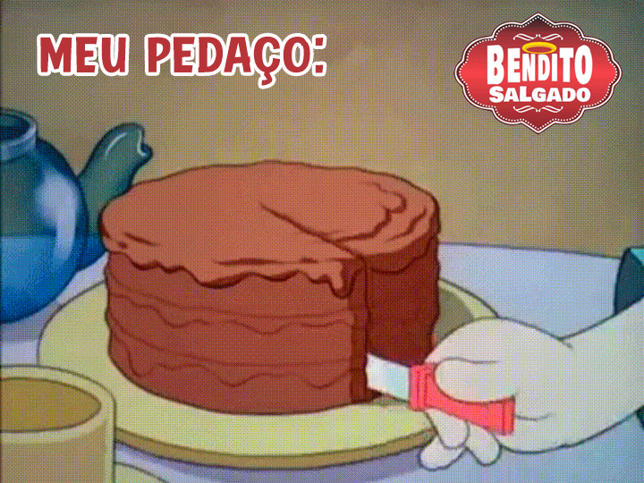

🍰 Projeto Receitas Interativas

Bem-vindo ao meu projeto de site de receitas!
Este projeto foi desenvolvido utilizando HTML, CSS e JavaScript.
Ele permite a interação do usuário escolhendo temas (Dia 🌞 ou Noite 🌙) e exibindo receitas de forma responsiva e animada.

  

Exemplo:

Dica: Você pode gravar um pequeno vídeo do site com a extensão Screenity, transformar em GIF com o ezgif.com e colocar aqui.

🛠️ Tecnologias Utilizadas
HTML5

CSS3

JavaScript (puro)

Google Fonts (Oswald, Roboto, Pacifico, Spline Sans, Viga)

Responsividade básica com Flexbox

🎨 Funcionalidades
👤 Saudação personalizada: O site pergunta o nome do visitante.

🌞🌙 Alternância de Tema (Dia e Noite) clicando no ícone.

📸 Animação de hover nas imagens de receitas.

📱 Layout adaptável para diferentes tamanhos de tela.

