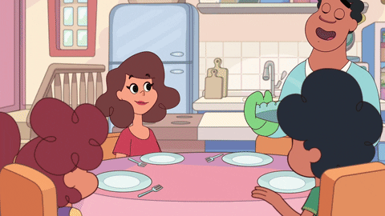

🍰 Projeto Receitas Interativas

Bem-vindo ao meu projeto de site de receitas!
Este projeto foi desenvolvido utilizando HTML, CSS e JavaScript.
Ele permite a interação do usuário escolhendo temas (Dia 🌞 ou Noite 🌙) e exibindo receitas de forma responsiva e animada.

  

🛠️ Tecnologias Utilizadas

Google Fonts

Responsividade básica com Flexbox

---

🎨 Funcionalidades

👤 Saudação personalizada: O site pergunta o nome do visitante.

🌞🌙 Alternância de Tema (Dia e Noite) clicando no ícone.

📸 Animação de hover nas imagens de receitas.

📱 Layout adaptável para diferentes tamanhos de tela.

